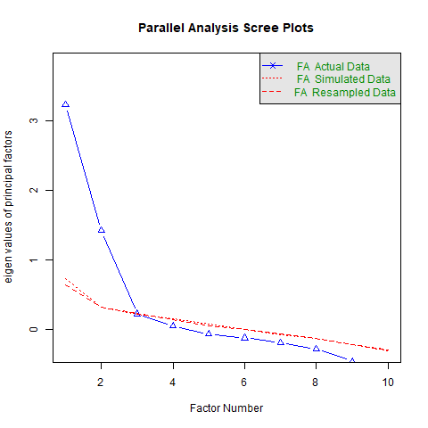

# ⚖️ psychometric-validation  
**Comprehensive Psychometric Validation of a 10-Item Scale in R**

> An R-based project demonstrating best practices for scale development, structural validity, and reliability assessment—ideal for quantitative researchers, psychometricians, and data scientists in behavioral sciences.


---

## 💡 What Is It?

This project provides a fully reproducible R script (PsychoScale.R) that executes a comprehensive validation pipeline for a simulated 10-item Likert-type scale. The goal is to verify the scale's fundamental quality metrics, including:

- ✅ Fidelity (Reliability): Internal Consistency ($\alpha$) and Temporal Stability (ICC).
- ✅ Structural Validity: Exploratory Factor Analysis (EFA) using Parallel Analysis.
- ✅ Criterion Validity: Correlation with an external health outcome.

The analysis successfully confirms the robustness of the simulated two-factor structure.

---

## 📦 Technologies

- **Psychometrics**: `psych`, `GPArotation`
- **Reliability**: `irr`, `ICC`
- **Data Handling**: `MASS`, `dplyr`
- **Visualization**: `ggplot2`, `factoextra`

---

## 📊 Example Output

### Structural Validity — Factor Determination
The Parallel Analysis strongly suggests a two-factor structure (2 components above the red simulated/resampled lines), confirming the theoretical model underlying the scale design.


### Factor Loadings and Statistics (EFA)
The factor analysis confirmed the expected structure (Factor 1 grouping items Q1–Q4, Factor 2 grouping Q5–Q8).
| Metric | Result | Interpretation | 
|---------|-------------|-------------|
| **Kaiser-Meyer-Olkin (KMO)** | $0.800$ | Meritorious sampling adequacy |
| **Cronbach's Alpha** | $0.814$ | Good internal consistency |
| **ICC (Test-Retest)** | $0.965$ | Excellent temporal stability |

### Generated Report
A text file summarizing all EFA, Alpha, and Validity results.


---

## ▶️ How to Run

```r
# 1. Install dependencies
install.packages(c("psych", "factoextra", "GPArotation", "irr", "ICC", "MASS", "dplyr", "ggplot2"))

# 2. Execute the validation script
source("PsychoScale.R")

# 3. Check Outputs
# Files will be generated in your working directory:
# - relatorio_validacao.txt (Full statistical summary)
# - scree_plot.png (Parallel Analysis visualization)
